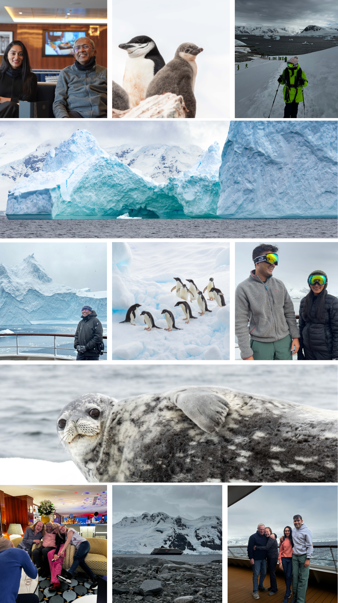
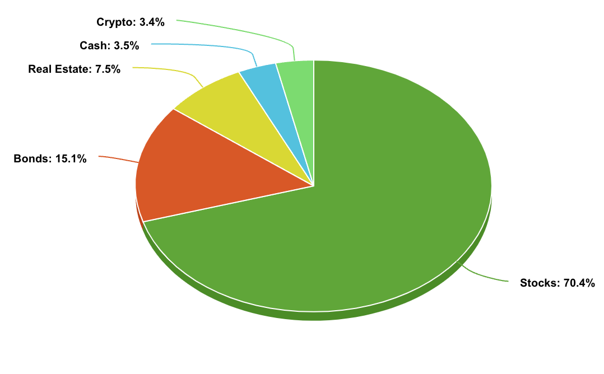
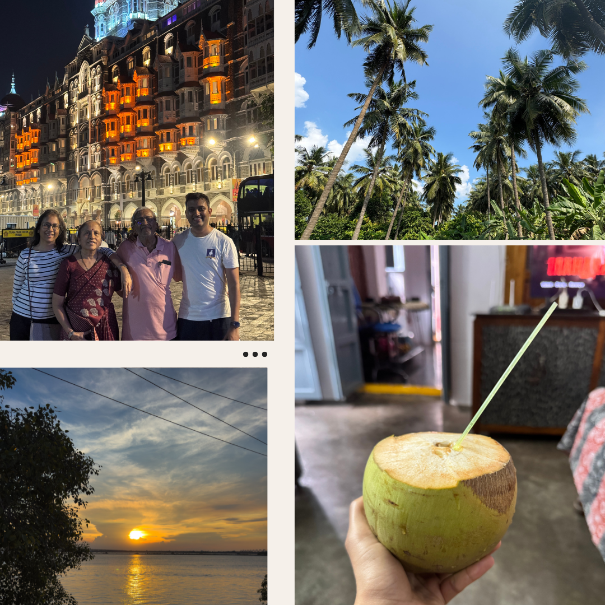
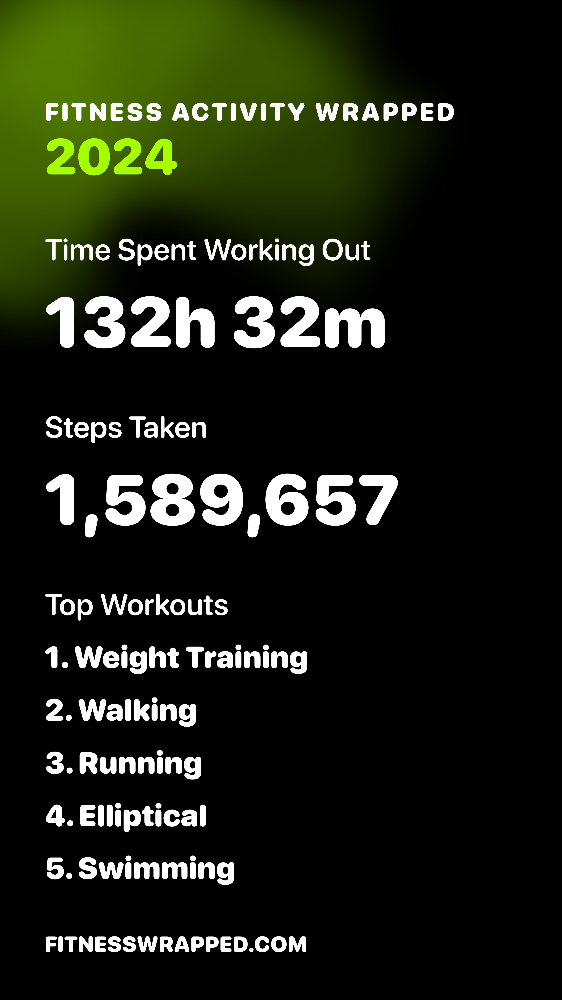

Year in end reviews are tacky but essential for intellectual reflection. Did we achieve what we set out to do? If yes, was it due to not setting the bar high? If no, was it due to unforeseen   issues or a failure of will? These questions don’t necessarily yield satisfactory answers, but then again, neither does the pursuit of excellence. 

I did a "review" of my 2022 but that focused a lot on moments / things / apps that stood-out. There isn't enough _reflection_. As such, I'll follow a different format for this one.

## Highlights

### Antarctica

Ever since I realized you can actually visit the white contintent as a tourist, Antarctica has been on my bucket list. There are tons of reasons why visting might not make much sense: the unrelenting cold, the notorious 4-day trek through Drake Passage, the amount of PTOs needed and the usual question: "What's there to see?". I had one simple reason convince me: I knew this trip is going to be a **[core memory](https://knowyourmeme.com/memes/a-core-memory)**.

The trip itself redefined expectations, largely because of the incredible people onboard—fellow tourists, crew, and even the cook. We stayed in touch and even met a cruise friend later this year. Antarctica was serene, cold, and unforgiving, even in summer. The journey was made even more special, as my father traveled 30 hours from Mumbai to join us. 

### Hans Zimmer

This was another bucket list experience I checked off this year, though not without twists. I originally booked tickets in Baltimore for a late September concert, but Hans fell ill and [canceled on the day](https://www.instagram.com/p/C_-iHtuoYlr/) while we were on-route, leaving us majorly disappointed. A few days later, my wife and I took a chance on the rescheduled Boston concert—and ended up experiencing one of the best performances ever!

### Finance

The US stock market doing well -- which meant we had a good financial year as well; While there have been a few changes, [our financial setup here](https://abhishekbanthia.com/fire/) hasn't changed much. There were unneccesary expenses (i.e. new subscriptions) which crept in, I was excited to hear and be able to use [Bilt](https://bilt.page/r/LAX4-CASE) to pay off our mortgage while accumulating points. 

Once you get past the basics with personal finance, the books and the general advice on the internet becomes trite (“VTSAX and chill”). While trite isn’t bad, it does become nauseating reading the same questions (and answers) over and over again in different forums. There were definitely a few interesting ideas that I stumbled upon:

- [Profit from under-withholding RSUs](https://tctailwind.com/2024/05/21/how-to-profit-from-the-under-withholding-of-rsus-and-bonuses/)
- [Maximizing Interest on Short Term Cash](https://tctailwind.com/2024/02/06/how-i-maximize-interest-on-my-short-term-cash-without-chasing-rates-across-banks/)
- Extreme Retirement Early (Cutting down on “Stuff”)
- [The Missing Billionaires](https://www.economist.com/finance-and-economics/2023/09/21/how-to-avoid-a-common-investment-mistake)

### Family

I got a chance to fly back to India to spend a good chunk of a month with my family as well as my in-laws; had some great food, met friends, bought a few canvas paintings but didn't travel as much as I'd like to. India is changing fast.

## Lowlights

### Work

Work was fullfilling.. but exacting. I've worked long hours for the most part of this job so I was already feeling a burnout symptoms, but I'm committed to the work I do and hence, I've managed. We had a few major launches which didn't neccesarily go as planned, making it impossible to seperate work and life -- it was honestly all work for a few weeks. It was exhausting. 

One of the biggest lessons this year was how working r1emotely from India isn't as good as it sounds. The belief that being a best of both worlds quickly fell apart as it was hard to sufficiently concentrate during 2 am meetings. The balance I'll try to pursue going forward will be to work during my first week (taking advantage of the jetlag) -- nothing more.

### Health

While I did manage to squeeze a decent amount of workouts, there were a few health surprises in 2024. It seems, staying “healthy” is going to take more and more work each passing year. The stress creeping in also doesn't help. The surprise this year was my lipid panels being borderline high across multiple blood tests. This did a positive effect in that I ended up trying a few new things: **Sauna** and **Continuous Glucose Monitor**. The first was mostly done as a way to detox and get me to sweat often. The other however was a real eye opener; the spikes I observed after eating rice or even just drinking tea were mind-boggling. There's a growing trend among Indian fitness influencers highlighting the lack of protein in our diet (which I vehemently agree with) -- and I'll make an effort to incorporate more protein into my meals. 

### Reading

I did get my hands on a number of books, but I didn't complete most of them. Although this is bad for my [Goodreads feed](https://www.goodreads.com/user/show/6566801-abhishek), book completion rate is a metric I don't care much about (thanks [Naval](https://www.youtube.com/shorts/ScD1uOUMXro)). While I did pivot a lot to read magazines, this is my low-lights as I didn't spend enough time reading as much as I'd like to.

## 2025

I hope you have a good 2024.