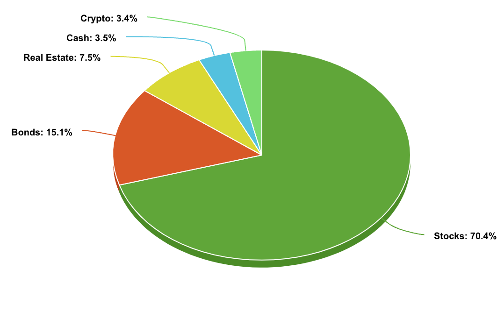

Year-end reviews are tacky but essential for intellectual reflection. Did we achieve what we set out to do? If yes, was it because we didn’t set the bar high enough? If no, was it due to unforeseen issues or a failure of will? These questions don’t necessarily yield satisfactory answers, but then again, neither does the pursuit of excellence. 

I did a "review" of my 2022, but that focused a lot on moments / things / apps that stood out. There wasn't any _reflection_. This year, I’ll follow a different format.

## Highlights

### Antarctica

Ever since I realized you could actually visit the white continent as a tourist, Antarctica has been on my bucket list. There are tons of reasons why visiting might not seem practical: the unrelenting cold, the notorious 4-day travel through Drake Passage, the amount of PTOs needed and the usual question: "What's there to see?". I had one simple reason: I knew this trip was going to be a **[core memory](https://knowyourmeme.com/memes/a-core-memory)**.

The trip itself redefined expectations, largely because of the incredible people onboard—fellow tourists, crew, and even the cook. We stayed in touch and even met a cruise friend later this year. The journey was made even more special, as my father traveled 30 hours from Mumbai to join us. Antarctica was serene, cold, and unforgiving, even in summer, yet undeniably beautiful. It felt as though we had been transported back several centuries in time to a place untouched by humanity. 

We also made smaller trips to Niagara Falls, NYC, Florida with a bigger trip to Mumbai. These served as a great way to de-stress and meet up with friends and family.

### Hans Zimmer

This was another bucket list experience I checked off this year, though not without twists and turns. I originally booked tickets in Baltimore for a late September concert, but Hans fell ill and [canceled on the day](https://www.instagram.com/p/C_-iHtuoYlr/) while we were en route, leaving us majorly disappointed. A few days later, my wife and I took a chance on the rescheduled Boston concert—and ended up experiencing one of the best performances ever!

### Finance

The US stock market performed amazingly -- which meant we had a good financial year; While there have been a few changes, [our financial setup here](https://abhishekbanthia.com/fire/) hasn't changed much. There were unnecessary expenses (e.g., new subscriptions) which crept in, I was excited to hear and be able to use [Bilt](https://bilt.page/r/LAX4-CASE) to pay off our mortgage while accumulating points. I did make a substantial bet on VHT (-ve) and bought more big-tech in particular Alphabet and Apple (+ve).

Once you get past the basics with personal finance, the books and the general advice on the internet becomes trite (“VTSAX and chill”). While trite isn’t bad, it does become nauseating reading the same questions (and answers) over and over again in different forums. There were definitely a few interesting ideas that I stumbled upon:

- [Profit from under-withholding RSUs](https://tctailwind.com/2024/05/21/how-to-profit-from-the-under-withholding-of-rsus-and-bonuses/)
- [Maximizing Interest on Short Term Cash](https://tctailwind.com/2024/02/06/how-i-maximize-interest-on-my-short-term-cash-without-chasing-rates-across-banks/)
- Extreme Retirement Early (specially: [Cutting down on “Stuff”](https://earlyretirementextreme.com/day-2-decluttering-and-managing-stuf.html))
- [The Missing Billionaires](https://www.economist.com/finance-and-economics/2023/09/21/how-to-avoid-a-common-investment-mistake)

YNAB is still our budgeting tool of choice; they have raised prices, but the app is half-usable now that it supports reports. Having spent some time looking at our asset allocation; there are a few areas where we can optimize:

- The amount of cash we've in hand is a bit too much.
- We haven't audited our insurances -- car, home etc. 
- We'll have a major life event if things go well in 2025, as such:
	- Budgeting for baby expenses
	- Add in a new potential 529 plan.
	- New family car

### Family

I got a chance to fly back to India to spend a good chunk of a month with my family as well as my in-laws; had some great food, met friends, bought a few canvas paintings but didn't travel as much as I'd like to. India is changing fast.

### Giving

This year, we had the opportunity to visit the charity we donate to in person in Mumbai and meet the team who worked behind the scenes. Many have been serving for decades -- some starting young whereas others began after retirement; it was inspiring to hear the stories, learn about the challenges they face, even learn about their financials. While money has diminishing marginal utility, giving and spending on family are definitely the areas that bring me immense happiness.

## Lowlights

### Work

Work was fulfilling.. but exacting. I've worked long hours for the most part of this job so I was already feeling symptoms of burnout, but I'm committed to the work I do and hence, I've managed. We had a few major launches which didn't necessarily go as planned, making it impossible to separate work and life -- it was honestly all work for a few weeks. It was exhausting. 

One of the biggest lessons this year was how working remotely from India isn't as good as it sounds. The belief that being a best of both worlds situation quickly fell apart as it was hard to sufficiently concentrate during 2 am meetings. The balance I'll try to pursue going forward will be to work during my first week (taking advantage of the jet lag) -- nothing more.

### Health

While I did manage to squeeze a decent amount of workouts, there were a few health surprises in 2024. It seems, staying “healthy” is going to take more and more work each passing year. The stress creeping in also doesn't help. The surprise this year was my lipid panels being borderline high across multiple blood tests. I did ended up trying a few new things: **Sauna** and **Continuous Glucose Monitor**. The first was mostly done as a way to detox and get me to sweat often. The other however was the real eye-opener; the spikes I observed after eating rice or even just drinking tea were mind-boggling. There's a growing trend among Indian fitness influencers highlighting the lack of protein in our diet (which I vehemently agree with) -- and I'll make an effort to incorporate more protein into my meals. We did take a few (more) steps in the right direction: swimming classes, a Peloton etc.

### Reading

I did get my hands on a number of books, but I didn't finish most of them. Although this is bad for my [Goodreads](https://www.goodreads.com/user/show/6566801-abhishek), book completion rate is a metric I have stopped caring about ([reason](https://www.youtube.com/shorts/ScD1uOUMXro)). While I did pivot a lot to read magazines, this is under low-lights as I didn't spend enough time reading as much as I'd like to.

## Standouts

Continuing the theme from 2022, here are the best ofs:

- **Purchase**: Our dark wood flooring makes even the smallest speck of dust stand out, so we’ve always had to clean up immediately after meals. We decided to automate this problem away through the [Dreame](https://fburl.com/0u76tf51) robo-vaccums; they've proven to be reliable, seamlessly handling transition between our wood flooring and carpets, and okay at edge-cleaning. We actually ended up buying two of them.

- **App**: I did spend an inordinate amount of time using Reddit (bye Apollo :() based on my Screen time stats; however, [ChatGPT](https://chatgpt.com/) has -- no exaggeration -- replaced Google for me. I spend it to find prices for different items, using o1 to talk through difficult decisions and use Voice Mode for hands-free communication. 

- **Movies**: My Letterboxd says I watched [28 movies](https://letterboxd.com/abhish3k/) in 2024; but there wasn't any debate for the top shot. Denis Villeneuve knocked it out of the proverabial park with [Dune 2](https://letterboxd.com/film/dune-part-two/); I had the privilege of watching it twice -- once on the 70mm -- and I'm still awed by the aerial shot where Paul sifts through the crowd while visiting South of Arrakis. A masterpiece! 

`video:https://www.youtube.com/watch?v=Wnh1mOTfhgw`

## 2025

Going into 2025, we want to spend time doing what we like and outsource the mundane chores. We have found an amazing robot-vacuum which has already saved us countless hours; and in 2025, we'll be hiring a cook to come in weekly to help out with cooking. Our modest up-bringing makes us feel guilty about paying someone to do things we could easily do ourselves, but work stress leaves us with so little free time. Anywho, here's the list of goals:

- Maintain and nurture the strong bond with my wife, especially as we'll have a big transition this year
- Surprise my parents on their 50th wedding anniversary
- Push on the health-front; become crazy-fit! Exercise a bit most-days, with special attention to weight training. 
- Pursue weird projects and create more.
- Run a 5K!

2025 is going to be a grind; here's to surviving and even... thriving