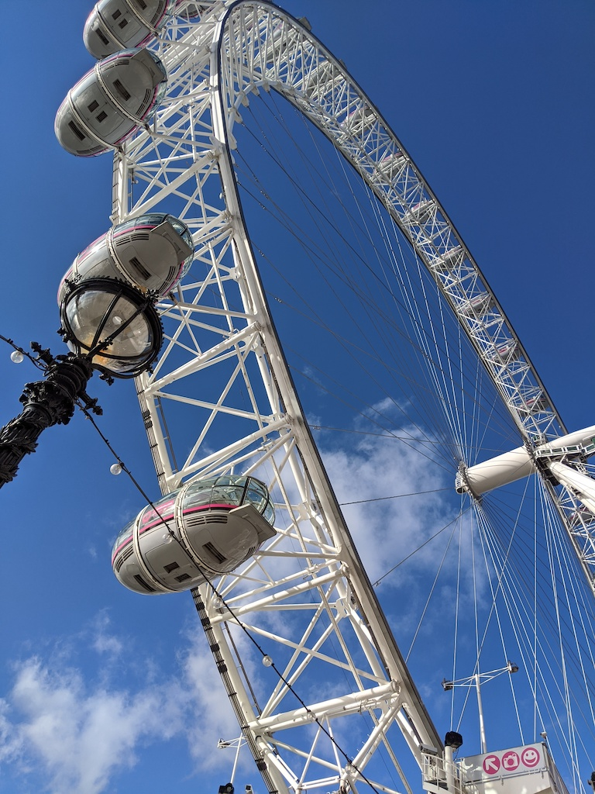
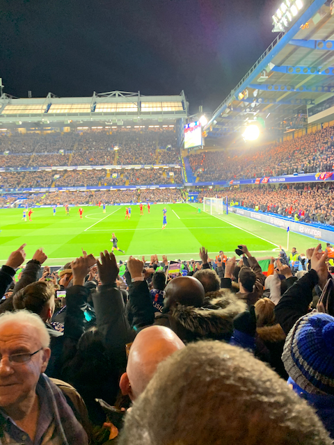
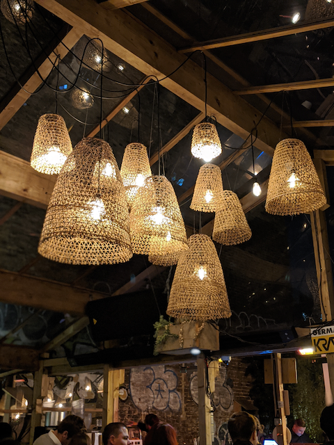

I've always counted 4 major cities as the hub for pioneering industries, fashion, creativity and diversity. Mass swaths of outsiders (mostly millennials) are attracted to these cities because they're hip. Peoples want to live the lifestyle of these cities and claim to be a local. One of the four cities is **London**.

London has always drawn me. Both the countries I’ve lived a significant amount have been influenced by the UK in varying degrees. London has the English Premier League, the beer is here culture, the afternoon high tea and of-course the jeans-dropping accent. When I got a chance back late last year to visit for 9 days, I – figuratively – jumped at the opportunity. For purposes of book-keeping, below is the summary of my travels to London, United Kingdom.

___

# Day 1 – The Arrival.
The stand-out perk of work-related trips has to be the comfortable travel. My employer flies you business-class if the distance between the source and destination is >4000 miles. Business class brings you:

Fast-tracked security process.
Comfortable seating on-flight with a three-course meal, flowing alcohol, wide-angle Android powered tablet with the latest and greatest movies.
Nice(r) headphones, pouch with skin-care goodies, multiple charging ports
Air-hostesses that’ll badger and pamper you (there’s a DND option as well)
Quick departure on landing (as you’re next to the Exit)
Access to Arrival lounges at your destination with showers, food and more.
Safe to say, my first Business class experience was phenomenal. I drank multiple glasses of the bubbly, gorged on the snacks and finished watching too-many movies from my To-Watch list. Our team decided to sleep-in a little early as we were projected to land at 2 AM PST. Surprisingly, forcing myself to sleep was very hard. Maybe it was the amount of the hooch but my more sober colleagues corroborated my experience!

We arrived at LHR at around 8:50 AM UK time (~50 mins before expected). It took me a while to gather myself when the visa officer started asking me questions in the quintessential British accent. I was asked about my purpose, where I was coming from and that’s it. I was granted entry! I had to wait a little longer for my SO and decided to take advantage of the arrival lounge. The shower room at the United Lounge at LHR gave me a quick head-start. SO arrived and we took a Uber to our hotel which was in the city! The sun was out, the roads were a little wet and the radio was playing classical music. Decent start. On our way, we got a glimpse of the Natural History museum, the London bus and the narrow – but bustling with people – city streets.

Our hotel was glamorous. Situated right next to the China Town, it was right at the core of all major activities. Leicester Square, Piccadilly Circus, James Park, walking distance to Buckingham Palace plus host of hipster-clubs and food-joints. More importantly, it was ~10 mins walk to both of the offices that I needed to work from. Jet lag hit us after our check-in and so we had to take a ~2hour nap. Refreshed after the nap, we decided to check-out the nearby Hyde Park. The time was close to sunset. We took a nice long-walk near the pond (home to some excited ducks) and grabbed a Cappuccino from the cafeteria. Next stop was the Sushi place. I’ve had a piece of cooked Sushi before but this trip was when I had my first uncooked Salmon sushi.

Fortunately, the nap had refreshed us and so we decided to hit a Jazz club. One unique thing about London were the long queues to get-in. We met long-queues at the Jazz club, an amazing Indian restaurant (Dishoom) and a skin-care shop at James Park. Back to the Jazz club. Turned out, instead of titillating live Jazz, this was a dance club playing tunes that we never heard. Fun night and 10/10 would return.

Walking back to our hotel was when I first encountered another unique thing – makeshift open restrooms on the side of the road for men. This was innovative, weird for the other gender but an absolutely ingenious idea for alcohol guzzling people. These restrooms had 4 slots and were only near the side of the roads during the night. *London 1 – Rest of World 0*.

---

# Day 2 – Escargot
We had an early morning brunch reservation at the Wolsley‘ (close to Piccadilly). This was a sought-after place with hard to get reservations. The interior had the old-Victorian look with servers dressed in sophisticated uniforms.

I ordered the Cheese and Potato fritters (which was delicious) and topped it off with an Escargot shell. The escargot was texture-rich and chewy with an interesting flavor.

Afternoon was where we explored the London Eye and the Natural History Museum. Jet-lag was kicking in hard at this point. We decided to check-out Roti Chai (an Indian Street Food joint) ordering Dhoklas, Bhel and more. The chai was supercalifragilistic. Strong, masaledar served in a classic glass cup. We were pretty tired but we needed to do three things.
1. Dinner with Colleagues (Amazing!!)
2. Sim Card for SO (went for a 3 plan which gave us 10 gigs for 15￡)
3. Kick-off Presentation for Monday

We did 2/3 from the list and luckily the presentation was postponed. Dinner was amazing as we shared stories about our childhood while eating Gnocchis.

---

# Day 3 – Meeting the London team.
We had a good productive work-day meeting the collaborating team and kicking off our side of things. Since London is less busier and is in a different timezone, your ability to find an empty meeting room to work goes up rapidly.

After work, we decided to grab Indian food at Dishoom at Carnaby. Having been at my fair share of Indian restaurants in the US, Dishoom left me bewildered. It was incredible to see people line-up for Indian food and cocktails on a Monday night. Even after a reservation, we had to wait for close to 30 minutes for our table. After which, it was a smooth ride. Compared to the restaurants out here, Dishoom offered an exquisite, diverse and delicious menu. In terms of vegetarian options, it had Okra Fries, Chole Puri, Chole-Chawal, Oat Chai and Kala Khatta Gola and more.

Recommend Dishoom with two thumbs up!

---

# Day 4 – The Game.
The most anticipated day of the trip (for me atleast). Wrapped up my meetings and work early and headed to the Tube to catch a tube from our hotel to Stamford Bridge. On match-days, the tube schedule is a bit weird. For our 19:45 game, the last train to Chelsea was going to be at 18:15 and resuming at 23:00 hours. Since we were a little late, we had to Uber to the stadium.

During our walk to the stadium, we encountered plenty selling game-day scarfs and jerseys. There were people asking for donations, selling match-day programs for a quid but overall it was a fantastic experience.

---

# Day 5 – The Book of Mormon.

More work and caught the amazing Book of Mormon!

---

Day 6 – Work. Work. Work.
The penultimate day before my presentation about Health to our collaborating team. As usual, my eyes perked up at around 6 AM and I was up early. The rest of my day was spent trying to fix Navigation for the Playgrounds app simultaneously trying to prepare for tomorrow.

My style of working is usually waiting until the second to last day before the deadline. Surprise Surprise. Nothing changed. The only preparation I did during official work timings was working on the getting the dashboard up and ready. I was up late at night working on finishing up work and the presentation reaching the hotel room at around 8:50. Dosas were ordered and I went to sleep at around 11:30ish hoping to an early morning start to finish up my presentation.

---

# Day 7 – Shaftesbury Ave + Mercato

Bless the lords coz I did have an early head-start. My eyes opened up at 4:30 and I was in front of my computer at 5. I do spend a lot of time fiddling about the presentation design and I’m glad I did that this time around too. The standard Facebook presentation template is great! A custom Facebook Sans font along-with the right hue of blue gives it a minimalistic yet a professional look. I worked around till 8 AM before getting ready, booking a meeting room for 8:30 AM and heading to the Shaftesbury Avenue office.

The Shaftesbury office was closer to the hotel than the Rathbone office. The entrance was delicately decorated and bore little resemblance to the MPK office. Similar to NYC however, this office worked mostly through elevators. I had booked a room for 21/2 hours in lieu of the presentation on the 8th floor. Looking back now, I basically spent 95% of the time on the content rather than the delivery (something that I need to rectify for my future presentations).

The moment arrived. People joined in both physically and through VC. In a moment of sheer genius/luck, my presenter notes were turned off. This is pivotal in small meeting rooms otherwise people assume you’re just spouting off a script. The presentation went alright. Questions were asked (indicative of general interest) and I was greeted with a few compliments.

The walk back from the Shaftesbury offie to Rathbone was a happy one. The Chana Masala Kathi Roll couldn’t have tasted better. The rest of my afternoon work was interrupted because of COVID-19 but I did manage to push out diffs that wrapped up my work with Hugo. I left for my hotel at around 2:40 PM. In the hotel room, I did some work and managed to squeeze in a quick 45 min nap. At 5, my SO and I left to do some sight-seeing covering the following:

- Leicester Square (Mr. Bean + Shakespeare)
- Trafalgar Square
- Mall Street
- Piccadilly Circus
- Regent Street

The last part of our night was taking the tube to Elephant and Castle. Our final destination was going to be Mercato Metropolitano. Mercato is a market where different food stalls come together with some loud music. We managed to snag a bite of the local Falafel and it would be fair to say it was amazing (comparable to Amsterdam).

---

# Day 8 and 9:

The last two days were spent sight-seeing and visiting touristy attractions including Buckingham Palace, Big Ben, Tower Bridge among others. It was during these last two days where the novel Corona-Virus was spreading rapidly in Europe but London carried on as usual!

Summarizing the unique things we found here:

- Cash-Less Payments – Tap your credit card to use the tube and the buses. Made our lives so much easier.
- Betting on the Streets
- Sim Cards – Local sim cards from Vodafone, Three are available for as less as £8. Do plan ahead!
- First times are the most memorable and London wasn’t an exception to this rule. Ending with a resonating quote:

> A bad day in London is still better than a good day anywhere else. -Unknown
