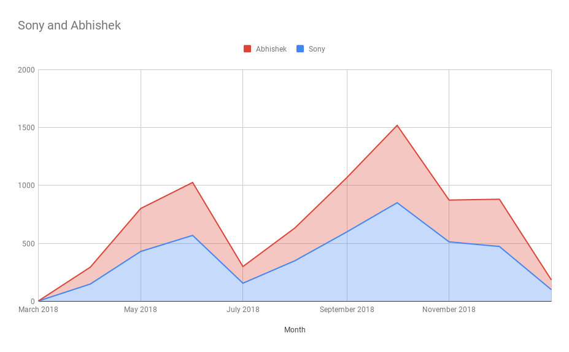
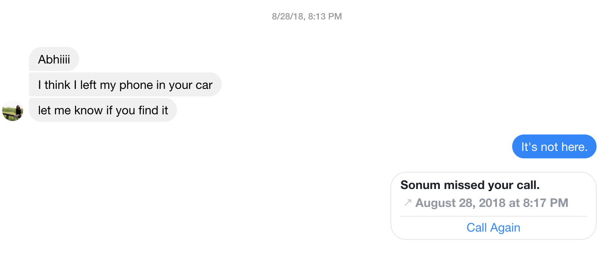

2018, for me, had many personal highlights. A new job, getting a chance to see my family, new cities and states, but more importantly; I met you. We had an incredible year together, and so, for Valentines day, I wanted to do something nerdy and take at a look at relationship closely. I dig through our chats (7584 odd messages) and our online history to find out some interesting things.

Start

Let’s start. Do you know what’s our favourite day of the week to text?

Well, it’s Tuesday!

Not surprisingly, we’ve kept each other quite busy. More importantly, we chatted even more frequently when you abandoned me and went to India in October.

One of the (not necessarily nice) things I have learnt about you is that you forget your phone or your wallet quite frequently.

Remember this exchange? Yes, you lost your phone and we drove back to Old Chicago eventually finding the phone in my car. You’ve a lot to learn about keeping important safe (from me 😆).

We’ve also shared songs through our chat. [Here’s a cool playlist with the songs](https://music.youtube.com/playlist?list=PLYSUzOes0kJE3D14_814qYkY5ASwh00H-).

Here are some weird Netflix movies we ended up watching:

- Rang Rasiya – 7/21/18
- Get Smart – 7/13/18
- Set It Up – 6/19/18
- How to Lose a Guy in 10 Days – 6/18/18
- New Girl: Season 1: Secrets – 6/16/18
- New Girl: Season 4: Dice – 6/16/18
- Ibiza: Love Drunk - 6/9/18

## Happy Valentines Day!

- Source: WhatsApp, Messenger, Netflix viewing history etc
- Extenutating factors:
   - We talked over office Skype a lot which adds to message variability.
   - When you went to India
   - Half data for end of June is not available
