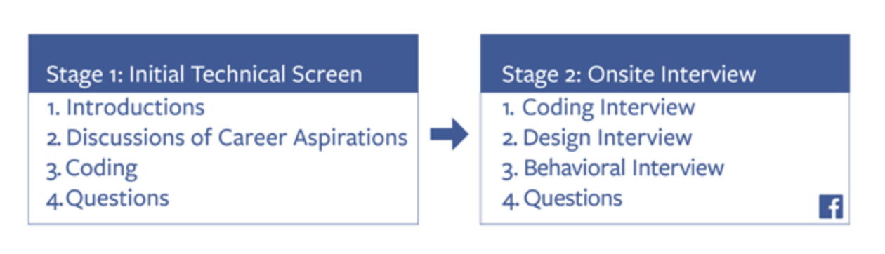

> The views expressed below are mine and mine only! I’ve learned a lot through other engineers sharing their interview experiences. Maybe someone can learn something from mine.

Ever since my friends/colleagues heard that I joined Facebook, there’s been a common theme around the questions that I’ve been asked:

- “Did Facebook reach out to you for an interview?”
- “How were the interviews like?”
- “How many interviews were there?”
- “How did you prepare?”

I wanted to answer these questions in one long post but I decided to cut this out into two pieces with tips sprinkled in:

[Part 1] Getting the interview call + Passing the Phone Screens
[Part 2] The Dreaded Onsite

> How did I end up getting an interview call from Facebook?

Well, I’ve my 6-month co-op at Apple to thank for. When I was in my final semester (Spring 2017), I applied to all the Big Ns and ton of medium-sized and small startups. Sure enough, I had a university recruiter at Facebook reach out to me. The initial recruiter screening mostly centered around my internship (ignoring my side-projects and other past experiences) helping me draw a strong conclusion on why I got selected.

The interview process is divided into two stages i.e. phone screens and a final onsite round. Number of phone-screens can vary based on your performance.

The date for the initial phone-screen was chosen and I started studying. I half-assed a ridiculously optimistic study plan (completing CTCI and ~50 Leetcode questions) and I failed the interview. Failed because I couldn’t complete an absurdly easy Linked List question. Looking back, I was extremely fearful of failing and making me a fool of myself in front of the interviewer. Scared that I might get asked the one question I skipped, or failing to answer something trivial that every CS student must know.

> Fast-forward to one afternoon in July 2018, I receive an email from a different Facebook recruiter this time hiring for iOS engineers.

We schedule an initial call which surprisingly included a 5-question iOS quiz that I was not prepared for. Luckily, I managed to answer all of them correctly proceeding towards the phone screen.

This time around, I was serious. I created a quick list of questions and books that I wanted to tackle before the phone-screen and decided to go all in. I didn’t want to bow out this time because of my inability to answer a Linked List question. This was an extremely intense month for me as I had to juggle work and my interview prep. I did very little socializing during this time and concentrated solely to getting onto the onsite round. I completed almost all Leetcode Easy and Medium questions asked for FB. I researched the company values and had my post-interview questions prepared.

> My body was ready.

Facebook phone screens have a typical format that the interviewer will walk you through. The first 5 minutes are for small-talk, while the last 10 minutes are reserved for questions for the interviewer. The 45-mins in between are to solve 2 coding questions that test your algorithm and data-structure knowledge.

Unlike the last time, I was better prepared and passed my phone-screens fairly easily. Here are a few things that helped me immensely in my prep:

## Preparation

The first thing I started doing after the call was scouring Quora, Medium, personal blogs and articles about interviews at Facebook. I found [Interviewing with Facebook — Onsite Part 1 – Ted Bendixson – Medium](https://medium.com/@theobendixson/interviewing-with-facebook-onsite-interview-part-1-572d33a5737a) and [I just got a developer job at Facebook. Here’s how I prepped for my interviews.](https://www.freecodecamp.org/news/software-engineering-interviews-744380f4f2af/) to be beneficial guides. I also started creating a list of potential questions that have been asked (with great help from Glassdoor and Leetcode). I knew **Data Structures** and **Algorithms** will occupy majority of my prep time but talking to the recruiter made me realize that **System Design** knowledge was crucial as well.

## Prep Material

- Leetcode Premium
- InterviewBit
- Mock Interviews on Pramp and other sites
- [Elements of Programming Interviews in Python](https://www.amazon.com/dp/1537713949/ref=cm_sw_em_r_mt_dp_U_yRNnEb39DAPWE)
- [Cracking the Coding Interview](https://www.amazon.com/dp/0984782850/ref=cm_sw_em_r_mt_dp_U_oWNnEb4KR9AYR)
- [Mike Ash’s blog](https://mikeash.com) to brush up on Obj-C and Foundation internals
- Introduction to Algorithms (referred it a couple of times for BT and Graphs)
- Youtube Videos for System Design (recommend this one)

Everyday as soon I as got back from work, I started doing 3 things:

- Revising questions I did the previous night
- Implementing a data-structure or a CS-101 algorithm from scratch on my own
- Solving 2-3 questions from EPI or Leetcode

I tried to follow this routine religiously up until the week of my interview. I also tried to do 2-3 mock interviews every week (which helped me immensely to get into the interview groove). Since I was going to interview for an iOS role, I also spent significant time during the week to focus on basic and advanced iOS, Objective-C and Swift topics.

## Data Structures and Algorithms I covered

- String Manipulation and Linked Lists
- Arrays, Sets and Maps
- Stack, Queues, Deque and Priority Queues
- Binary Tree, Binary Search Tree and Heaps
- Graphs and Tries
- Sorting Algorithms
- Graph and Tree Traversal Algorithms
- Dynamic Programming

The approach of simultaneously working on Leetcode and DS/Algorithm really helped solidify my understanding of the trade-offs.

### Tips

Inform the interviewer of the brute force solution immediately (this way they’ll at least know that you’re not stupid). After this, try and optimize the run-time or space-time. This’ll let the interviewer know about your thought-process and critical thinking abilities.
Don’t worry if you’re completely stumped by a question. Be calm, clarify the question and try and see if you can come up with a brute-force solution at-least
Use helper methods stubs and tell the interviewer that you’ll come back to these later-on.
Don’t be afraid to show that you’re human and you have shortcomings. BS-ing doesn’t come across as a good trait. You don’t need to excel in all the rounds to get an offer!
Don’t over-eat at lunch, otherwise you’ll drowsy (in which case ask for a toilet break and splash some water on your face)
You will fail. You will mess-up. Your phone interviews won’t go well. You’ll bomb at white-boarding. Don’t be afraid. Failure leads to success.
