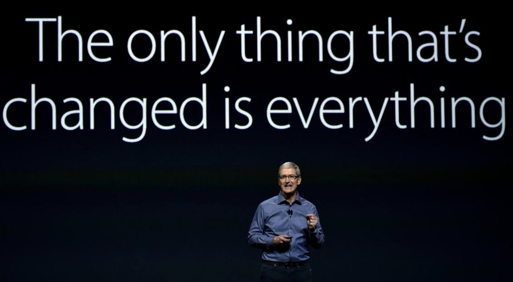

> Disclaimer: View described below are my own and do not reflect those of my employer!

Granted it’s been not a long time since I’ve been working at my new job; but the macro below is pretty apt! Ever since graduating, I’ve worked more than a few jobs. I started off as a technical editor and moved on to becoming an app engineer! What was different with a FAANG? Let me list it out.

## Pace
There’s a lot to do and you’ve got to do it fast! There are a couple of important reasons why:

First, as a mobile engineer, you’ve got to make sure your code is checked-in before the weekly release branch cut. If you don’t make it, you have to wait until the next week. And a week is a plenty of time to wait.

Second, since we dog-food and do small A/B tests for each new feature we ship; it’s plain likely that your awesome new feature might increase the engagement metrics but regress the startup time. While you debug why that happens, a week goes by → you figure out what’s wrong → you ship your fixes → your fixes are dog-fooding → if all’s well, we go for a public test again. You go through this cycle again and again unless your code is absolutely bug-free™ and doesn’t impact any company critical metrics negatively.

This is in start contrast to your two-week sprint! There’s no grooming or assigning points to tickets 🎫. There’s no QA you can fall back on to verify your new awesome feature is working as expected. At the end of the half, your performance is based on the features you’ve shipped and since it takes a decent amount of iteration to launch something; you better be quick.

## The A/B Testing Culture
There was a slight learning curve involved with this. I had no background in experimentation, creating control/test groups, logging exposures, gate keeping with kill-switches etc.

Our team has a weekly experiment review where we go through ongoing experiments that engineers are running and make a ship/no-ship decision. It’s a little bit more involved than what I described, but you get the gist. My first few weeks in Experiment Review was just me taking notes as others used different acronyms every few seconds. I felt lost! I misconfigured experiment setups and I always felt I can do better during my experiment presentations. In hindsight, this was expected. As time has passed, it’s become more easier. And what’s helped is peer feedback on my experiment setups, presentations and helping me understand just how everything works.

To be honest, I’ve come to believe experimentation slows us down. We A/B test features even as small as introducing haptic feedback on tapping a button. Granted, we tend to be more confident since testing verifies our initial hypothesis for launching a new feature. But keeping two pieces of code and iterating for months for a feature that just adds something minimal just contradicts the Move Quick culture that has made the company grow so fast. I’ve come to admire how the fruit company operates even more now.

Just yesterday, one of our Data Scientists mentioned to me that we — product engineers — use A/B testing as a fallback testing mechanism to find bugs instead of actually trying to find a good variant of our code to ship. As I think about it, that’s actually true!

## Coding and Autonomy

One of the best things I’ve loved about working here is that I can go in tomorrow and fix a bug in our Source Control system or our AR/VR frameworks pretty darn easily. I can dive deep into how the News Feed works or see how caching is implemented for Instagram Stories on Android without the need to ask any permissions or switch teams. This is one of the best selling points for me as an engineer and a tinkerer.

You’ll also get some great feedback in code reviews! Let me sum up my learnings:

- Binary size regressions due to Obj-C metadata bloat.
- Power of Protocols (especially useful in the A/B testing world where you have pieces of code that achieve the same thing).
- MACROS to enforce nullability and avoid subclassing! 
- Composition > Inheritance.
- Defensive programming.
- Use `firstObject` instead of accessing by bounds and more.

This would be a good time to stop. I feel there are a lot of other things that I can’t remember right now or can’t mention unless I want to violate my employee confidentiality. But yeah, things’ are’a changing!

