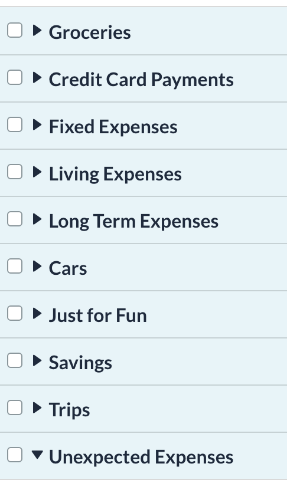

Now that my wife and I have stable jobs that we hope to continue for the atleast for the new few years, it's time to think about money. Money is a powerful tool -- which if you use correctly -- can provide you with utmost freedom and the capability to optimize my life around my personal values. This freedom can be in the form of being able to work in the field of your choice, or it can be the ability to work from anywhere you want without a set schedule.

After scouring plenty of books/blogs/podcasts on this subject -- full list below --, we've made a few radical changes that I list below; These resources has also made us think deeply about our long-term goals and what we want from life. I'm going to take this post to present our current financial thinking in depth.

## Budgeting

This is something that we started doing pretty recently using [YNAB](https://www.youneedabudget.com/). I personally gave YNAB a try when I was in Mumbai; but back then YNAB required frequent manual book-keeping (recording transactions, making sure everything is up-to-date) and was extremely US centric. YNAB is still mainly catered around needs of US residents but has added a plethora of features like automatic transaction syncing through Plaid, easier credit-card handling and more. 

### Why YNAB?

Admittedly, even after you setup your budget, YNAB does require a very hands-on involvement. And that's the one of the reason why I like YNAB - it forces us to spend more time thinking about how and where our money is spent. It's not a set-it-and-forget-it (cough cough Personal Capital and Mint) kind of financial service. YNAB puts you in control and makes you think deeply about our spending priorities. After using the service for ~30 days, what I love about YNAB is:
- You need to put every available dollar you've to work.
- Set explicit, time-constrained saving/spending goals
- Budget reports ([Toolkit for YNAB](https://github.com/toolkit-for-ynab/toolkit-for-ynab/) provides even more granular income and spending breakdown)
- Account Reconcilliation which forces you to go to cross-check balances

YNAB is expensive ($80/yr) and you can make a decent argument about how a good, strategic spreadsheet can do most of YNAB offers. But there two, good reasons why YNAB wins out:

1. Automatic, up-to-date transaction syncing
2. Easy to share most of the info with a SO
3. Convenient apps for phone, watch and the web!

With that said, I did encounter that on a few occasions, my Chase account syncing was delayed by over a week. There's also the fact that YNAB handles credit-cards in an unusual manner and it did take a signficant learning curve for me personally to figure it out!

## Investment Allocation

- Talk about asset allocation strategy
  - Pie Chart about distribution in individual stocks, ETFs, Index Funds, RSUs, 401(K)
  - Index Funds
  - ETFs 
  	- Cathie Wood and ARK
  - 4% Rule
- Risk Strategy
- Gambling
	- GME FOMO 
- Bank Accounts
	- Savings Account
		- Ally and Marcus
		- Consolidate in one
	- Bonuses
		- First Republic Bank
		- Explain why these days maybe behind me.
	- CDs
	- Fixed Deposits in IN

## Opinion

## Resources

- [Mad Fientist](https://www.madfientist.com/podcast)
- [Simple Path to Wealth by J.L. Collins](https://www.goodreads.com/book/show/30646587-the-simple-path-to-wealth)
- [I Will Teach You To Be Rich by Ramit Sethi](https://www.goodreads.com/book/show/40591670-i-will-teach-you-to-be-rich)
- [Die With Zero by Bill Perkins](https://www.goodreads.com/book/show/52950915-die-with-zero)

