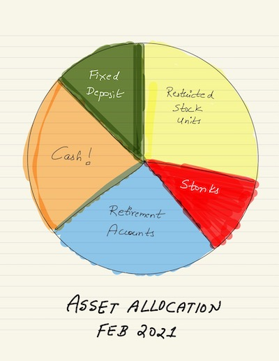

Now that Sony and I have stable jobs that we hope to stay at for the new few years, it's time to think deeply about our finances. Money is a powerful tool; if used well, money can provide you with freedom, autonomy, and the capability to optimize your lives around your belief system. This freedom can be in the form of being able to work in the field of your choice or it can be the ability to work from anywhere you want.

After scouring plenty of books/blogs/podcasts on personal finance and FIRE, we've made a few radical changes that I list below; These resources have made us think deeply about our long-term goals and what we want from life. I'm going to take this post to present our current financial thinking in depth.

## Goals

I'm a hedonist. If there was something that I think I would enjoy, I would be willing to spend money on it. At the same time, I (try to) follow a **buy-once-but-buy-it-for-life** approach. Now that we're somewhat stable in our lives, I've realized I don't want to work away my precious young years. 

We're potentially looking at buying a house in our near future which means we'll need to get a mortgage. [Mortgage forces most people to work at jobs they don't like](https://earlyretirementextreme.com/why-financial-independence-part-i-early-motivations.html). That's not going to be us! 

> We allegedly live in a free society. We pride ourselves on our freedom. We use freedom as a slogan to go to war. Thinking about it though, most people voluntarily, indeed without a second thought, sign away their freedom for most of the daytime hours. They sign away their freedom to go where they want between 9 in the morning and 5 in the evening. The are not free to choose what clothes to wear. They are restricted in what they can say. They are restricted in what they can think about. This isn't freedom.

Our goal is to achieve [FIRE](https://en.wikipedia.org/wiki/FIRE_movement). We believe we can reach that goal by working hard, living frugally and investing any surplus we have. Visa status is one big complication in our lives which might lead to us holding onto our jobs for longer than we want to; but we believe we can find ways around that. For FIRE, our goal is to save up until we're able to live off 4% annual withdrawal of our investments for the rest of our lives. Easier said than done, but hey, at least we've a plan.

## Budgeting

Where your money is being spent is fundamental to a sound financial footing. Budgeting leads to cost-cutting in areas you don't care which leads to more money being available for wealth building. Budgeting is something that we started doing pretty recently using [YNAB](https://ynab.com/referral/?ref=DNUpEP_S_rP7VdUr&utm_source=customer_referral). I personally gave YNAB a try when I was in Mumbai; but back then it required frequent manual book-keeping (recording transactions, making sure everything is up-to-date) and was extremely US centric. The tool is still mainly catered around needs of US residents but has added a plethora of features like automatic transaction syncing through Plaid/Chase, easier credit-card handling and more. 

### Why YNAB?

Admittedly, even after you set up your budget, YNAB does require hands-on involvement. That's one of the reasons why I like YNAB - it forces us to spend more time thinking about how and where our money is spent. It's not a set-it-and-forget-it (cough cough Personal Capital and Mint) kind of financial service. YNAB puts you in control and makes you think deeply about your spending priorities. After using the service for ~30 days, what I love about YNAB is:
- You need to put every available dollar you've to work
- Set explicit, time-constrained saving/spending goals
- Budget reports ([Toolkit for YNAB](https://github.com/toolkit-for-ynab/toolkit-for-ynab/) provides even more granular income and spending breakdown)
- Account Reconciliation which forces you to go to cross-check balances

YNAB allows me to set categories granular enough to easily dig into what financial areas we need to focus on. We've moved to different cities, travelled widely, switched apartments and granular data helps in understanding our spending for these time buckets. YNAB also makes it trivial to calculate our monthly saving % and how it's varying over the course of year. This is an important metric for us and YNAB has made it easy to keep a close eye on it.

YNAB is expensive ($80/yr) and you can make a decent argument about how a good, strategic spreadsheet can do most of YNAB offers. But there are few good reasons why YNAB wins out:

- Automatic, up-to-date transaction syncing
- Easy to share most of the info with a SO
- Convenient apps for phone, watch and the web!

With that said, I did encounter that occasionally, my Chase account syncing was delayed by over a week. There's also the fact that YNAB handles credit-cards in an unusual manner, and it did take a significant learning curve for me personally to figure it out!

## Asset Allocation

Our current asset allocation leaves a lot to be desired. Given that we've no dependents, debt and are doing okay health-wise (touch wood), Sony and I can take a bit of risk. Just by looking at the pie-chart, I can see a few areas where we can make significant changes. Few things that're in our 2021 pipeline in the order of importance:

- Open a IRA (one of the recommendations [from this book](/book-review-i-will-teach-you-to-be-rich/))
- Deviate more cash to ETFs/index-funds
- Dollar-cost average large investments
- Divert $$$ from low performing individual stocks to ARK ETFs
- Consolidate our various bank accounts (we have 7 accounts between me and my SO)
- Build a gambling fund to buy meme stocks (more below)

### Gambling fund

The whole GME story has brought about the trend of viral meme stocks (usually propped up by the baddies of r/wsb) to the forefront. ARK and other investment funds have categorically stated that it follows social media trends closely. I felt a big tinge of FOMO all through $PLTR, $GME, $ROKO etc sky-rocketing and dropping a few weeks later. It made me seriously consider keeping aside a small % of my investment allotments for "gambling" purposes. This allotment could go into meme stocks, crypto-currency or an old-fashioned penny stocks. 

Why? Nobody has gotten "rich-rich" by investing consistently in index funds. Index Funds/ETFs will guarantee wealth preservation but are not great tools for wealth-building. All the rich guys out are making money either through entrepreneurship or by concentrating all their $$$ in a selectively hand-picked stock. Warren Buffet chose individual stocks. Chamath and friends allegedly owned 5% of the world's bitcoin. I do know that I need to be substantially lucky if I want to make money in this fashion, but I feel a small gambling fund is a good fail-safe that can appease my FOMO side.

### ETFs and Index Funds

The general crowd seems to prefer index funds with the biggest reasons being the index funds update their price only at EOD; whereas ETFs are like regular stocks with the ticker price updating every few seconds. This volatility can influence people to make rash selling decisions. The expense ratio for both these asset types are low since they're passively managed. Personally, however I prefer ETFs for two reasons:

- Convenience (easy to buy through RH)
- No minimum balance restriction (Vanguard requires $3K minimum)

### ARK ETFs

I'm a Cathie Wood fanboy ever since her ballsy 2018 $TSLA bets. She's a OG wagering her $$$ on innovation especially exponential innovation. Their picks have historically done well and cynics might say the whole stock market is doing extremely well. Few have said this might be the Midas Touch phenomenon. This might be true or the reality is Cathie and her team are superb at picking stocks! What I know is that the expense ratio of these ETFs (~0.03%) are comparable to low-cost index funds (~0.02%). I'm going to be closely following and potentially investing a lot of my $$$ in ARK ETFs (Ark Space ETF -> I'm coming 🚀). 

### Bank Account Bonuses

First Republic recently had $750 bonus if you open a new checking account, direct deposit your salary and maintain > $15K in balance for the over the course of 3 months. Back in November, this sounded like a great deal. Minimal effort and guarantee payout. However, on later introspection and reading a few books, I've realized I could have gotten a better ROI by investing the same money in ETFs/Index funds. Here's a contrived example:

Let's say I've $15K in principle and I earn about $3K in salary/month. To meet First Republic's bonus requirements, I need to maintain close to $30K of our liquid cash in their checking account for a period of 3-4 months. Let's assume I moved my principle and changed my direct deposit system to redirect to First Republic in November 2020. After about 3 months, my total share in the new checking account would be $30,750 ($30K + $750 bonus). 

Now if I had invested the same amount of the money in $AAPL back in November 2020, my portfolio would be up to $33K (up by 11%). The $750 bonus seems measly compared to this. Forget the real-estate market, forget the bank bonuses, forget the bonds; there's isn't a better wealth-building tool than the stock market. I chose $AAPL since it's a reliable stock but if I wanted to play it safe I would've go with SPY or ARK ETF.

## Fin

We're lucky in a way that we stumbled onto FIRE in our late 20s. We've also made good financial decisions in the past which has helped us build a substantial egg-nest. 2021 is going to be the year when we dive-deep into our finances, turn the right knobs and tweak it enough so that we can hit our 🔥 goals.

## Resources

- [Mad Fientist](https://www.madfientist.com/podcast)
- [Simple Path to Wealth by J.L. Collins](https://www.goodreads.com/book/show/30646587-the-simple-path-to-wealth)
- [I Will Teach You To Be Rich by Ramit Sethi](https://www.goodreads.com/book/show/40591670-i-will-teach-you-to-be-rich)
- [Die With Zero by Bill Perkins](https://www.goodreads.com/book/show/52950915-die-with-zero)

