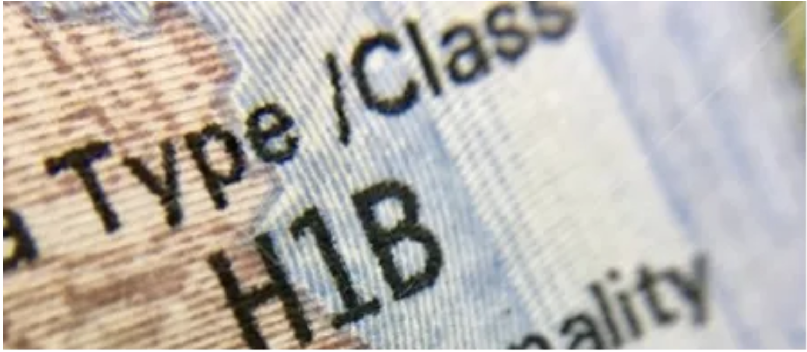

My first H1-B interview happened last week and I wanted to share my experience for documentation purposes.

### Monday – 9th Dec – VAC Appointment

- Reached the Parinee Crescenzo at 8:20 for my 8:30 VAC (Visa Application Center) appointment. A person near the entrance of the building verifies your appointment details and allots you a token (which I promptly lost in my sea of documents).
- Next, you need to enter the building and take the stairs to the first floor. At this point, your token is examined and it’s totally fine if it’s lost. Once again, your appointment details are scanned and your identity is verified through your passport.
Now comes the pat-down. Be sure not to take your phone, smart watch or any smart equipment in general. Wallets and keys were allowed for me (this is as of 9th December, ’19).
- The next step is where your DS-160 details are checked against your passport. I was missing my middle name as part of my given name in the form and was told to correct it. The good news is that the correction can be done next door to the VAC office. The bad news is that it’s expensive with simple DS-160 corrections costing ₹500, print-outs costing ₹100 + bag storage costing around ₹400.
- After my DS-160 correction, you go to Step 4 again and this time I was cleared. The final step is taking your photo along with furnishing your fingerprints. Upon successful completion, your DS-160 is stamped with two stamps and your passport is handed back to you.
- This concludes your VAC appointment. You’re ready for the next step and are told to come 15 mins next day before the interview.

### Tuesday – 10th Dec – Interview

I showed up at 9:15 for my 9:30 interview. Below is a quick transcript of my interview. Documents asked:

1. DS-160
2. I-129
3. Passport

```
Me – Hello. Good Morning (handed over my documents)
VO – Good morning.
VO – You did your schooling in the US?
Me – Correct
VO – When did you graduate?
Me – Summer 2017
VO – You served your OPT with a different company?
Me – Correct
VO – Was your OPT with the same company before?
Me – Answered
VO – What’s your job title in the current company?
Me – Answered
VO – Is this your first H1-B?
Me – Yes
VO – Where are you currently be working out of?
Me – Menlo Park, California
VO – What’s your annual salary?
Me – Answered
VO – Hands me a couple of informational pamphlets and says that your visa is approved. You should hear back within 2-5 business days. Thank you!
```

December is a busy month as you’d expect for visa interviews and December 2019 wasn’t any different. There were long wait times (20 mins outside the consulate + approximately 45 mins before your turn to interview arrives).

Back in 2015, when I waited for my turn to interview for my student visa, we could easily hear how the other interviews were going. This was somewhat corrected this time around. Unless you paid close attention, you really can’t make out if the person ahead of you got the visa or not. This made a little calm to be honest.

> EDIT: Received my passport on January 2nd (24 days after my interview). The wait was starkly in contrast to the 2-5 business day wait I was told to expect.

I’ll update the post with the dates when I receive my passport back with the stamped visa. Overall, a painless experience!