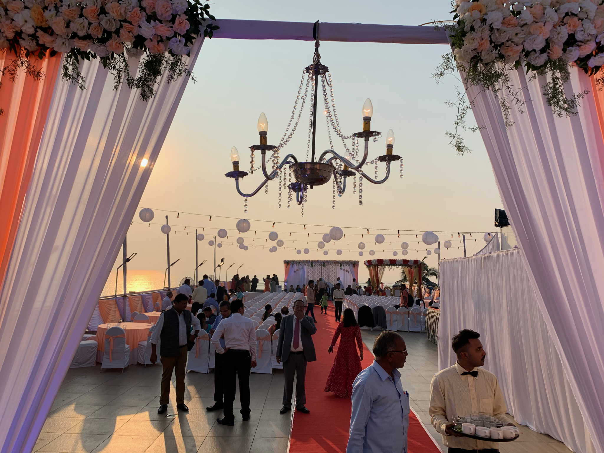
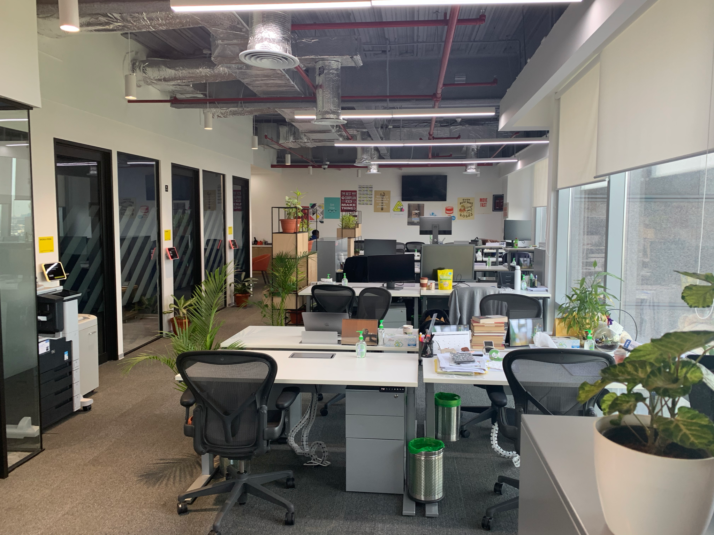
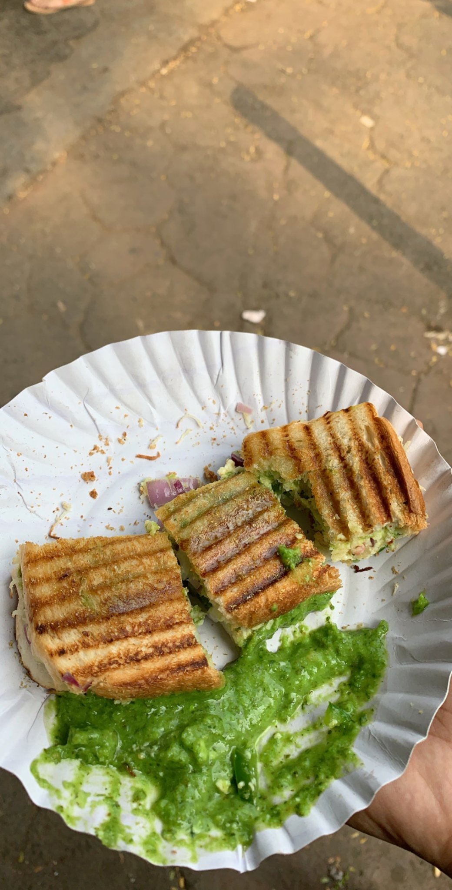
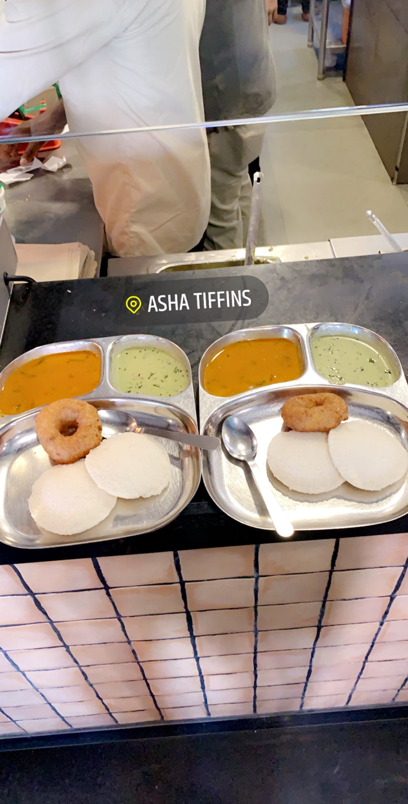
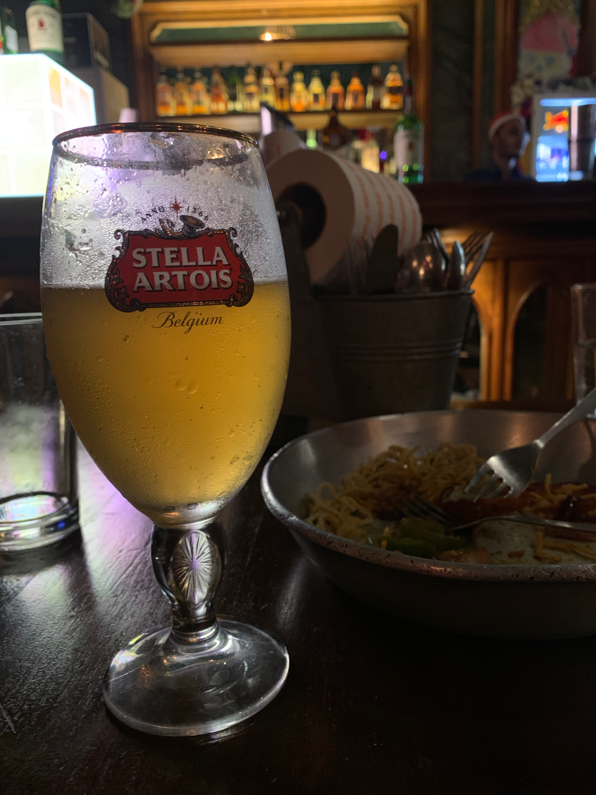
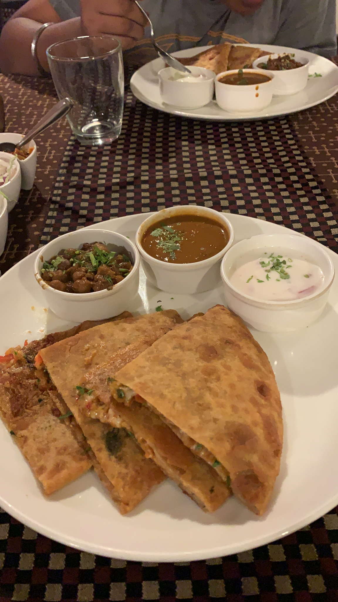

My pre-planned — yet inadvertently a surprise for many — trip to India was something that I was looking forward to since the last 3 years. 2019 was extremely challenging work-wise and I was intensely home-sick. I wanted to meet my relatives, my neighbors, my friends and most all my family. Suffice to say, I was excited beyond my usual amount.

Looking back, it was an exhausting, fun-filled trip with some unexpected surprises (tsk tsk US Consulate) that made me delay my eventual return. I, luckily, managed to accomplish a lot:

- Met plenty of friends + family
- Started a NRE account and opened a 7.25% FD through IDFC
- Applied for Global Entry (and luckily I was at home for PCC)
- Visited ~16 wedding venues + got an eventual plan ready for the wedding
- Visited Bangalore + Kovvur + Pune
- Applied for DL-reissue
- Checked out properties/apartments and discussed potential investment strategies
- Closed my Activity rings 22 times
- Took ~47 Uber rides + tens of rickshaw trips
- Showed up at my friend’ engagement on the wrong day
- First Escape Room with family
- Reviewed 4 new restaurants on Zomato
- Visited FB Mumbai and FB Bengaluru

 

## Working Remote
Even though Jio has revolutionized and brought LTE speeds to most of India for pennies, my parents decided it was wise to unplug our internet. There isn’t much use for a fast internet in our household (no Netflix, Prime); so their decision made total sense. But it left me in a quandary.

Fortunately, FB has made its presence felt in Mumbai through a new office in the hip BKC area. This and AT&T’s day passes helped me publish a few diffs and complete my PSC in time!

## Mumbai Musings
Coming back to Mumbai (and India in general), I quickly realized how good things were back in California. There’s abject poverty everywhere on display in Mumbai. There’s just too many mouths to feed. The population monster needs to be addressed and needs to be addressed quickly. Traveling in a rickshaw/Uber, you quickly see hundreds of people standing on the side of the road just staring into the passing vehicles. The rickshaw drivers often told me their sob stories. One was unable to pay the loan they took to buy the rickshaw (~2750 dollars) while another one was unable to pay for their son’s tuition. It was disheartening!

One prominent problem that I saw during my umpteen rides was the constant Gutkha spitting. The Supreme Court has banned Gutkha, and yet Gutkha is readily available. You probably will have to search more to find bread/milk whereas not so much to find your Rajnigandha. Almost every rickshaw trip had the guy doing a double-take at the traffic signal and spitting on the road. This needs to stop. For health reasons and for cleanliness’ sake.

The real-estate/car industries are in terrible shape. Talking to a friend, I realized there are 0.8 million empty apartments on the market and no buyers. Nobody’s buying any cars because the traffic is horrible and there’s no parking space left in Mumbai. I’m glad the local government is undertaking multiple Metro projects that should sufficiently cover major parts of Mumbai in the next ~5 years.

The CNN/Fox-News craziness has reached the India media. I managed to lose thousands of brain cells (in a fairly quick amount of time) when the news channels started with their debates.

Here’s hoping for better things when I visit next. Leaving with more photos 🙂

 

 

