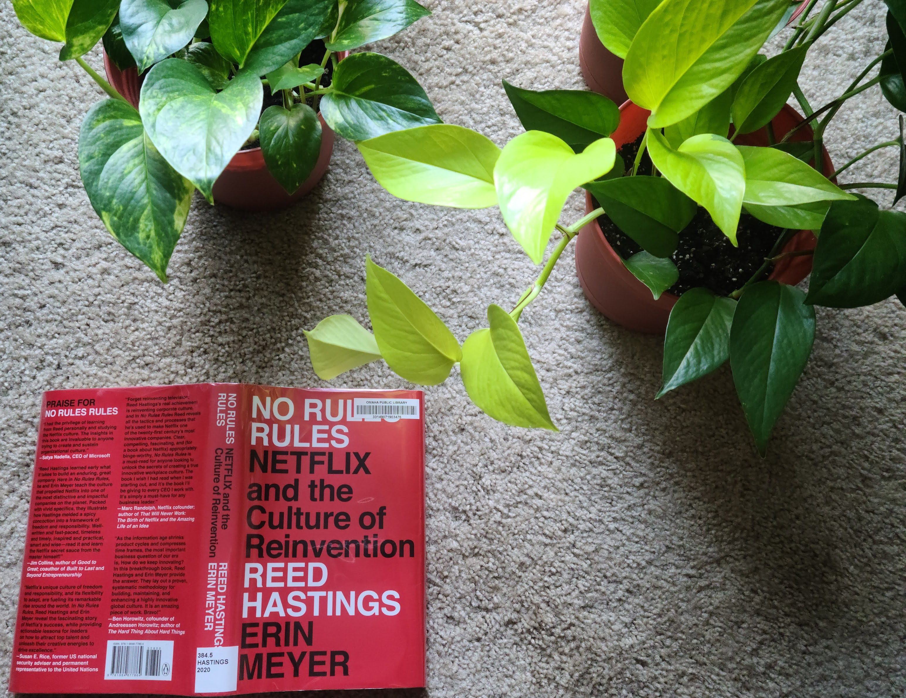

As an engineer, I've always been fascinated by myths surrounding Netflix and their employee culture. My first introduction to this was through their (in)famous culture deck and later [through this Reed Hastings interview on Blitzscaling](https://www.youtube.com/watch?v=jYhP08uuffs). And so when I saw [No Rules Rule](https://www.goodreads.com/book/show/49099937-no-rules-rules) trending in the world of books, I immediately grabbed a copy from my local library! Here are the key insights and my takeaways from the book:

## Maximize Talent Density

As a company show-runner, your number 1 goal should be to hire 10x rock-stars exclusively. Jerks, "adequate" performers or employees looking for job-stability aren't good fits for a company which heavily relies on innovation and creativity. Once you hire these top performers, pay them the top of market salaries. Don't pay performance based bonuses; instead put more resources in the salary. 

The "No Bonuses" policy is pretty unique and brilliant. Companies often dangle bonuses as carrots and use them as additional motivators. Bonuses are often attached to vaguely defined metrics (#impact) and those quickly change!

## The Keeper's Test

One of the most controversial about the culture deck was the "Keeper's test". Would you (as a manager) fight to keep an employee A if he decides to quit? If you won't, you should get rid of A. This keeps the talent density high, demands excellence from employees and instills a culture of "effort isn't enough". Following the Keeper's test, Netflix has 8% involuntary attrition which is 2% more than the average across US companies.

The "Keeper's Test" might be one of the reasons why I might never want to work at Netflix. As an engineer, I have my good days and my bad days. Good days happen way more often but there are certain days when I'm admittedly low in terms of motivation and productivity. I struggle with this. If I went to work at Netflix, I'd be always afraid of losing my job. Since I'm on a work-visa, losing my job has severe consequences not just for me but for my family. The keeper's test is a no for me.

> In a twisted sense of irony, Patty McCord who actually came up with the Keeper's test was actually fired for the same reason. Brutual.

## Increase Candor

Frequent, candid feedback is what helps outstanding performers reach the next level. Reviews happen once every year in both written and live format and the employees are encouraged to be very frank about their peers. No more peppering of constructive advice in the midst of fluffy positive feedback. Give direct and actionable advice. 

There are a couple of things I'll personally take away and try to start using in my daily day-to-day:
- Putting discussion items in the agenda for my meetings!
- Provide feedback using the 4(a) guidelines. 
- Shadow other brilliant engineers. (Reed was shadowed by Sheryl Sandberg)

Overall, No Rules Rule felt unemotional, no-nonsense and pragmatic. Maybe, this is what it takes to succeed!