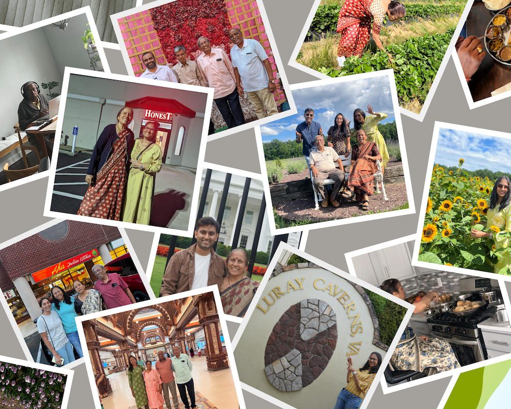

I'm writing this a day before my parents and my sister catch their flight back to Mumbai. The past 60 days have gone as quickly as a season of Succession: your perception of time shifts in that **I'll probably end up describing the months of May <-> July 2023 as the period when my family visited henceforth**. Reminiscing the past two months through photos, transactions and just plain memories was an eye-opener on how mid my hosting skills were. We did do the quintessential trips but my parents (especially my mom) expressed concealed anticipation for the day of the return trip. Alas, here are things to remember for the next time my parents come over.

 

## Recap

- **Richmond**: VMFA, Outlet Mall, India Mela, Lewis Ginter Botanical Garden, Farmers Market
- **Virginia**: Selden Market, Pagoda, Newport, Virginia Air and Space center, Critzer Farm, Luray Caverns, Shenandoah, Lavender Farm, Merchants Square at Williamsburg, Tyson Galleria
- **DC**: White House, Thomas Jefferson Memorial, Lincoln Memorial, Capitol Hill, Smithsonian National Museum
- **Philadelphia**: Liberty Bell, Reading Terminal Market, Amma's,  BAPS
- **West Virginia**: Lindy Point, Blackwater Falls, Snowshoe, New River Gorge Park
- **Expenses**: ~$8K excluding airfare

## Reflections

- Booking business class tickets for parents was a no-brainer. Future follow-up would be if this is required for all flights or for only long duration journeys.
- Traveling back home is way easier since we have way many public modes of transportation. This wasn't the case in the US for my parents since they do not drive. Having extra CSPs for Dad and sis helped tremendously. 
- After initial stumbles, we landed on using Google Fi for my Dad and sis to communicate locally while we were out and about. ~$100 but reliable.
- Mom suffered a small bout of vertigo prior to our Norfolk trip and we struggled to find relevant medicine(s). Carrying medicine for this ailment in-tow while departing from India might be more prudent next time.
- I did spend $10 to subscribe to IPTV, although the ROI wasn't much. The big use-case for this service was to see latest Indian news, but there were two learnings: Indian news at ~8:30 PM EST isn't as captivating and although not exactly live, YouTube fills in the void just fine.
- Fruit jams, Virginia peanuts, PRIME, chocolates, lavender flavored products, perfume for Jijaji were chosen as return treats. 
- The communication gap hasn't necessarily decreased between my wife's family and my family. Playing games like Chess, Snakes and Ladder and bonding over food helped.
- Given Mom' growing leg pains, hiking or visiting gardens that demanded lot of walking were out of consideration. Temples, on the other hand were a family favorite and so were movies.
- Dad and libraries were a match made in heaven. We visited libraries at Tuckahoe, Libby Mills and Glen Allen, with Tuckahoe being his chosen favorite. The libraries proximity to the recycling center also helped. Do need to keep an eye on library fines though.
- Fixing up electrical, plumbing outlets in the house with my dad didn't work out as I intended. The bidet sprayers weren't up to spec and the video doorbell setup proved too resilient. Dad took this a sign of failure and was vociferous in returning / asking for more help while I wanted to spend the time to figure this out by ourself. Going forward, it'll good to take up projects with a predictable route to success.
- On a personal level, try to be less sarcastic (especially with my interactions with my sister). Also, try to never run red lights.
- Mom isn't as adventurous in trying out other cuisines as my Dad / sis are. She won't say no but she's also not going to willingly ask.
- We didn't get a chance to go to the Goat Yoga experience or the Honeybee farms - which is a personal regret.
- Visiting the White House was a highlight and a must-do especially if someone is coming from far away.
- Dad wanted to set us up and become more familiar with the folks staying in our community. While this is noble, this goes against my nature of self-independence as this paints the perception that Abhishek needs help in the friends department. This is a me problem that I recognize, and while we didn't publicly discuss this, my hope is that in the future, I'll learn to accept help from others.
- Unlike last time, I won't be able to hand over the photo book to my departing family. Next time, order photo books a week in advance ([Once Upon for printing](https://app.onceupon.photo/)).
