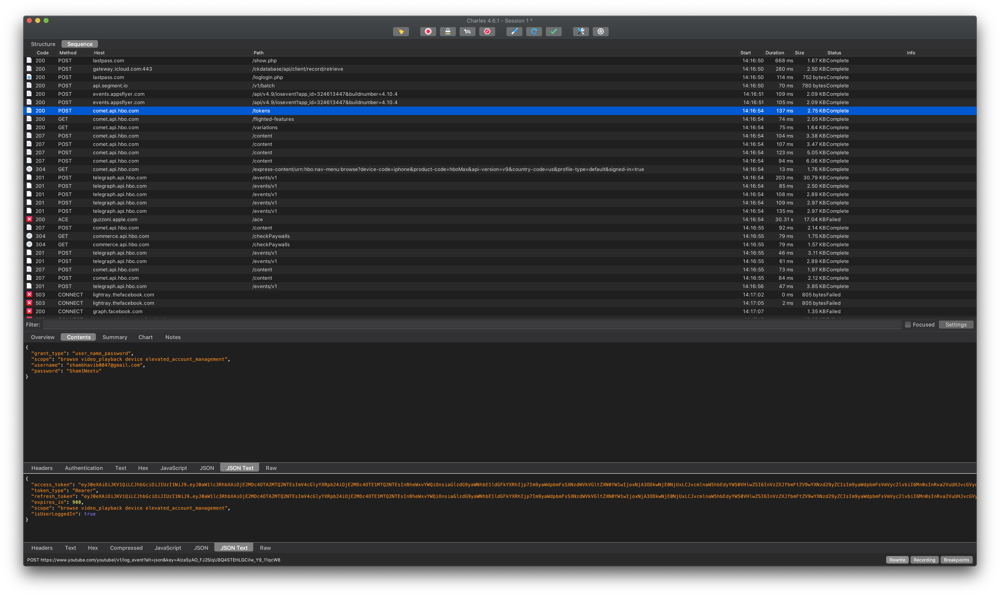
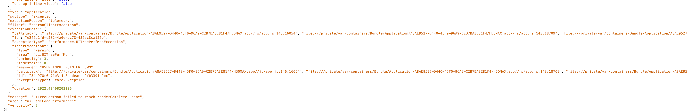

It's been a while since I [reverse-engineered APIs](https://github.com/n0shake/dash) and I realized I missed it. I missed the world of the jailbreaking, mitm and good' ol deconstructing how the sauce is actually made. I decided to play around with HBO-Max. Why HBO-Max? It's a newish app and in today's **M0ve Fast** companies, security (certificate pinning in our case) is usually low down in the Jira ticket list.

Maybe I'll find some info about an unannounced show. Maybe I will find nothing. Let's begin.

## Authentication

The base URL for all HBO max requests is `comet.api.hbo.com`. Seems like SV and the tech world in general have accepted that "Comet" is a cool project name. When you login in, the iOS app makes a request to `/tokens` with some suspicious payload. The `username` and `password` is send over the wire in `plain-text` (aka unencrypted) format. I know that Security in the www world is an illusion but atleast you can `md5` it. Why is sending your credentials in plain-text bad? Because if you've a compromised system, hackers can easily retrieve your credentials.

## Content

- Realized that we're HBO subscribers and not actually subscribed to HBO MAX. 
- I realized the Zip Code of my friend. 
- She's also opted into Marketing. Oof.
- You can also set PIN.

## Privacy

In terms of logging, HBO-MAX covers the industry gamut logging everything from impression to page-load times. Nothing sinsiter in the payloads here. All these requests go through their `telegraph.api.hbo.com` endpoint. Here's the list of events I noticed the app sending:

- App Launch Times
- UI Viewport Change (Change Type: Resize): This is a new one but I'm assuming this informs the images/video aspect ratio choices of a regular Joe
- Error Metrics
- Profile Switch Occurs
- SSO UPdate Status (Weird one since I'm not logged in via SSO)
- Page Launch Times (Subtype: Performance): They mark/track different points ("renderStart", "loadingDotsRemoved", "viewPortReady") and the time at which these points occurs so that they have granularity if a perf-related regression occurs.
- Navigation (switching of tabs)

They have a feature flag which can turn this off but a user-level, I couldn't find any toggle switch in Preference for this!

Also, it seems like they're using JS for their client code. I noticed this by looking at the stack of the exception that the analytics service sent. The un-UIKit behaviour is also visible with their navigation animations. The animation last 1-2s which them feel out of the place in comparison to other apps.

## Error States

Takes you straight to the Downloads page with the CTA saying "You're offline. Check connection." The button style is pretty unique. When the user re-enters, the app doesn't automatically re-connect automatically which might be something to add (?). Not a biggie. The Search Error State is delightful and provides quick info about things you can search ("titles", "genres", "brand", "actors").

## Good Things

- Studio Ghibli Movies
- No untoward crashes
- "Last Chance" before they're gone seems like a nice category